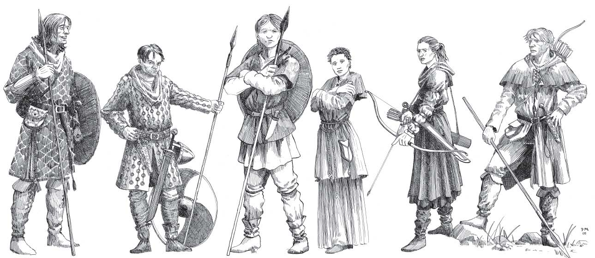

# HârnWorld Introductory Adventure: A Shower of Silver

[)].download_count&url=https://api.github.com/repos/toastygm/hm-adv-sos/releases/latest&color=green)](https://github.com/toastygm/hm-adv-sos/releases/latest)

This module provides the adventure "A Shower of Silver", an introductory murder-mystery
adventure for the [HârnWorld](https://columbiagames.com/harnworld/)
fantasy setting, located around Jedes keep in the kingdom of Kaldor. However, this
adventure could be located in any fantasy setting or location with minimal adaptations.

Although designed for use with the [HârnMaster](https://foundryvtt.com/packages/hm3)
system, this module is mostly system-agnostic, with the exception of Actors.
Detailed descriptions of the actors has been provided in journal entries to facilitate
conversion to other game systems.

# Credits

This module is made possible by the hard work of Neil Thompson and other HârnWorld fans, and is provided at no
cost. This work is an adaptation of the adventure [A Shower of Silver](https://www.lythia.com/adventures/a-shower-of-silver/) available at
the HârnWorld fan site [Lythia.com](https://www.lythia.com/).

**Writer:** Neil Thompson

**Contributors:** Matthias Janßen, Andy Gibson, Daniel Bell, and Allan Prewett

**Artists:** Richard Luscheck and Juha Makkonnen

**Playtest Referees:** Neil Thompson, Matthias Janßen, Andy Gibson, and Allan Prewett

**Playtesters:** Dave (no relation to Dan) Bell, Neil F (this character sheet is wrong!) Hepple, Robert L (George) Sanders, Dave Wilkinson, Andy Wouldham, Jörn Schmidt, Durk Vellema, Alexander Riedel, Hanna Fedderwitz, Ron Dill, Rob Duff, Michael Edmonds, J Patrick MacDonald, Jonathan Nicholas, Ken Snellings, Richard Black, Aaron Hay, Leigh Heron, David Hoey, and Jarick Prewett

**Adapted to Foundry VTT:** Tom Rodriguez

Thanks to Grant Dalgleish for permission to use the official ‘Sir Shernath Mirdarne’ illustration from the ‘Kaldor Kingdom Module’

This module is "[Fanon](https://www.lythia.com/about/publishing-fan-written-material/)", a derivative work of copyrighted material by Columbia Games Inc. and N. Robin Crossby.

